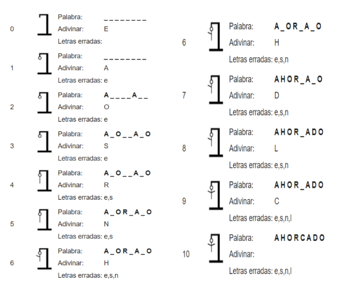

# Python

![GitHub - Seguidores][a]
![Modulo][b]

## Tabla de contenido:📚

1. [Introducción][0]
1. [Números enteros y reales][1]
1. [Proyecto Final][p]

## Introducción

Python es un lenguaje de programación versátil y de alto nivel que ha ganado gran popularidad en la industria y la comunidad de desarrollo. Fue creado a finales de los 80 por Guido van Rossum, y desde entonces se ha convertido en uno de los lenguajes más utilizados en diversos campos como desarrollo web, análisis de datos, inteligencia artificial, automatización y más.

Lo que distingue a Python es su sintaxis clara y legible, lo que lo hace especialmente fácil de aprender y utilizar. Su diseño y su enfoque en la legibilidad del código permiten a los programadores concentrarse en la resolución de problemas sin preocuparse por la complejidad del lenguaje.

Además, Python cuenta con una amplia comunidad de desarrolladores que contribuyen a su crecimiento y mejora continua. Esta comunidad activa brinda un amplio soporte y recursos, lo que facilita la resolución de dudas y el aprendizaje constante.

Python es multiplataforma, lo que significa que puedes escribir un programa en Python y ejecutarlo en diferentes sistemas operativos sin necesidad de modificar el código fuente.

# Proyecto Final
## Tabla de contenido:
- [🚀 Introducción][i]
- [¿Qué es el juego del ahorcado? ⚙️][ii]
    - [Descripción general 🔩][iii]
    - [Ejemplo del juego ⌨️][iv]
- [Actividad 📦][v]

## Introducción 🚀

_El proyecto final consta del desarrollo de un programa que permita la simulación del juego “El ahorcado” en el lenguaje de programación Python. La importancia del uso de la sintaxis y el orden lógico._
## ¿Qué es el juego del ahorcado ? 📋

El ahorcado (también llamado colgado) es un juego de adivinanzas de lápiz y papel para dos o más jugadores. Un jugador piensa, en una palabra, frase u oración y el otro trata de adivinar según lo que sugiere por letras o dentro de un cierto número de oportunidades.

### Descripción general 🔧

Usando una fila de guiones, se representa la palabra a adivinar, dando el número de letras, números y categoría. Si el jugador adivinador sugiere una letra o número que aparece en la palabra, el otro jugador la escribe en todas sus posiciones correctas. Si la letra o el número sugerido no ocurre en la palabra, el otro jugador saca un elemento de la figura de hombre palo ahorcado como una marca de conteo. El juego termina cuando:
* El jugador completa la palabra, o adivina la palabra completa correctamente
* El otro jugador completa el diagrama(dibujo)

### Ejemplo del juego ⚙️

El siguiente ejemplo de juego ilustra a un jugador tratando de adivinar la palabra Ahorcado utilizando una estrategia basada únicamente en la frecuencia de letra.

# Actividad 🔩
Diseña un programa que nos permita realizar la simulación del juego del ahorcado en el lenguaje de programación Python.

__Puntos a evaluar__
* Uso de listas.
* Programación orientada a objetos.
* Declaración de variables y funciones.
* Uso de estructuras de control y ciclos
* Comentarios en el código
* Usos de archivos externos (import)   

## Expresiones de Gratitud 🎁
* Comenta a otros sobre este el proyecto de Escuela de código 📢
* Sigueme en [GitHub](https://github.com/Alfonso6z)

[a]: https://img.shields.io/github/followers/Alfonso6z?style=social
[b]: https://img.shields.io/badge/Alfonso6z-Modulo_4-green
[p]:#proyecto-final
[i]:#introducción-🚀
[ii]:#¿qué-es-el-juego-del-ahorcado--📋

[iii]:#descripción-general-🔧
[iv]:#ejemplo-del-juego-⚙️
[v]:#actividad-🔩
[0]: #introducción
[1]:1_numeros_enteros_y_reales
[2]:2_operadores_aritmeticos/